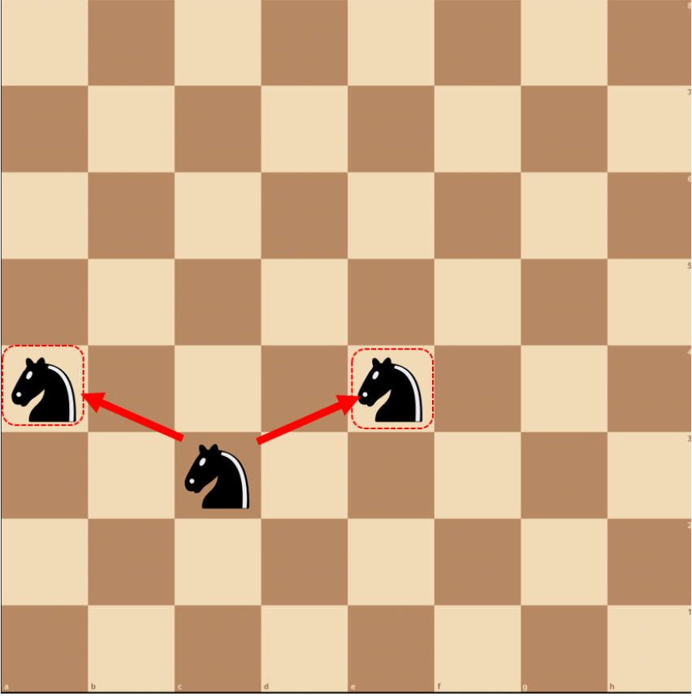
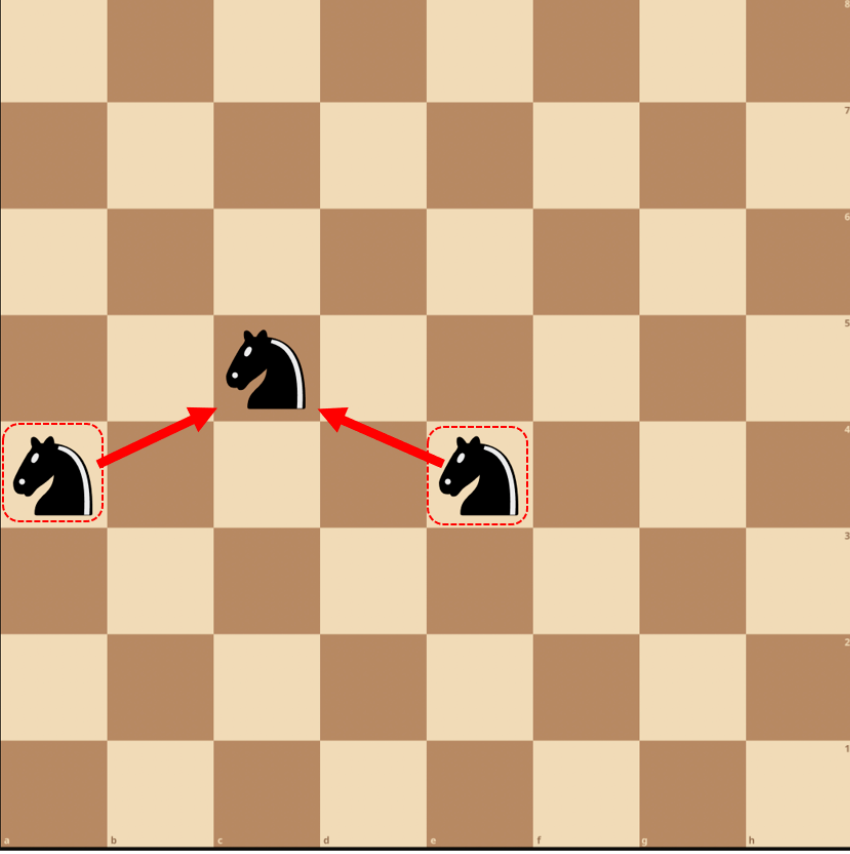
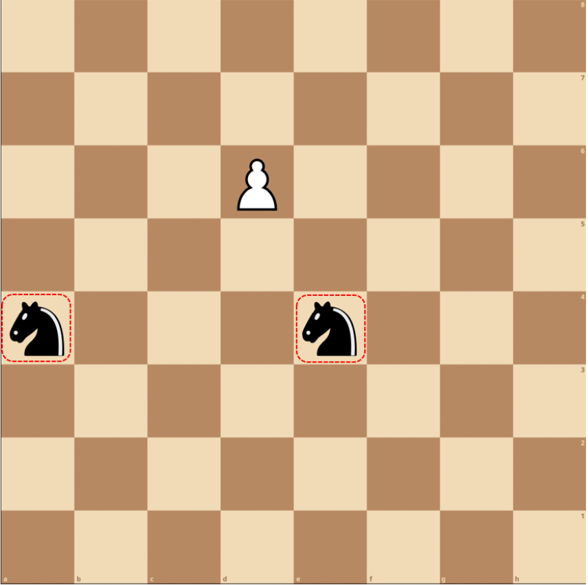
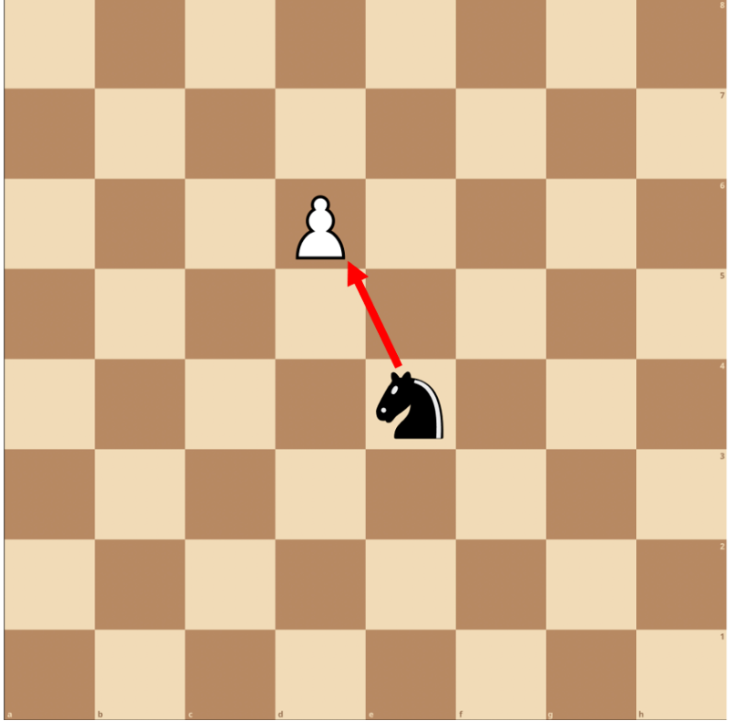
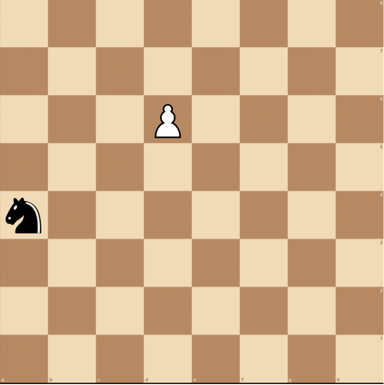
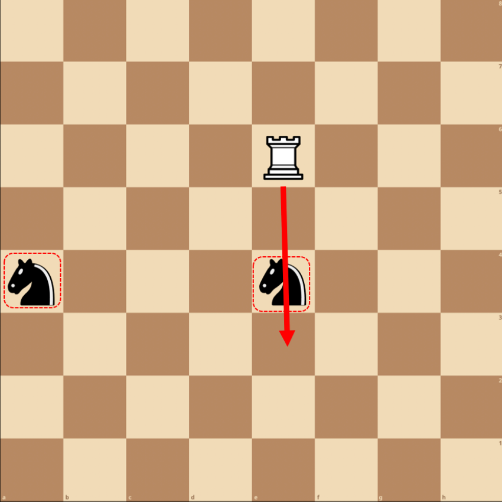
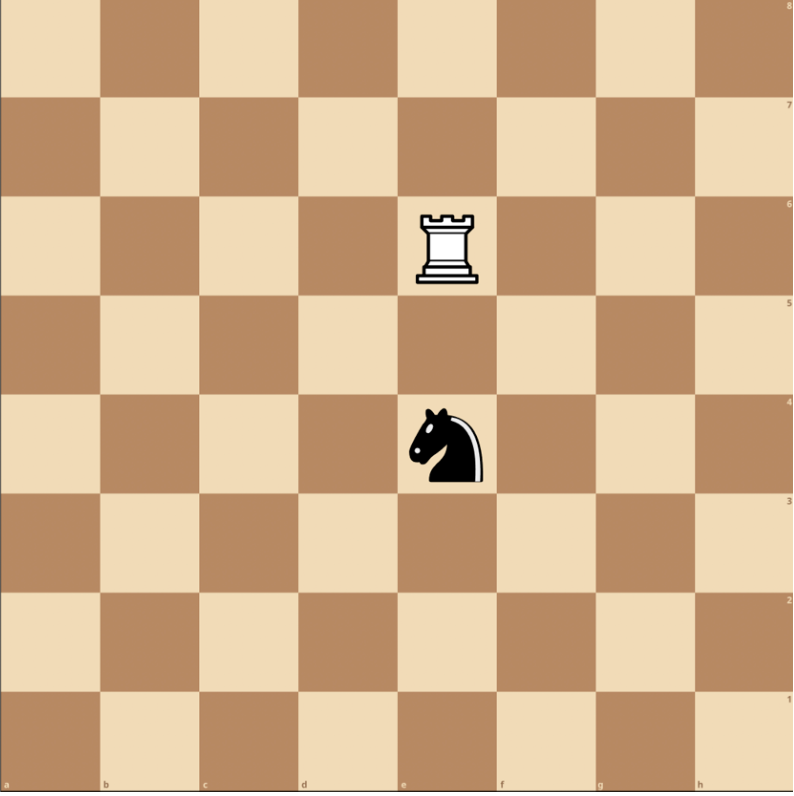
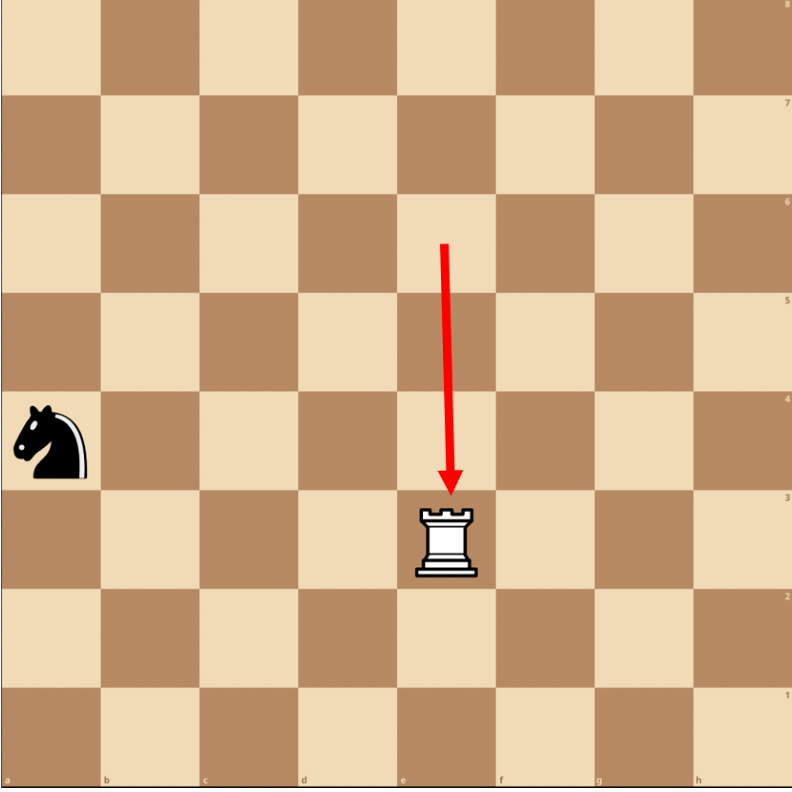
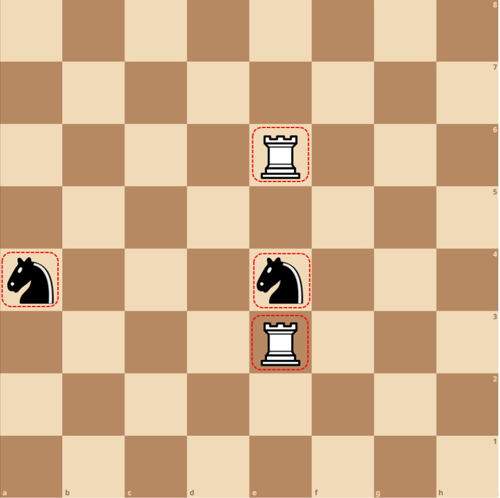

# QChess rules

(rules in Chinese language see below)

1. **Movement Patterns**: In Quantum Chess, every piece follows the same movement patterns as in traditional Chess. The pieces move according to the usual rules.
2. **No Check Rule**: Quantum Chess does not use the concept of ”check” that exists in traditional Chess. Therefore, any rules in traditional Chess that limit a King’s movements when in check do not apply to Quantum Chess.
3. **No Double Occupancy Rule**: This rule ensures that no square can have a non-zero probability of being occupied by two or more pieces with different values. At no point in the game should a square risk being occupied by more than one distinct piece.
4. **Pawn Behavior**: Pawns in Quantum Chess behave similarly to those in traditional Chess. They cannot split or merge. However, there are unique scenarios when pawns interact with quantum pieces.
5. **Measurement**: If an action (such as a move or capture) would result in a violation of the no-double-occupancy rule, a forced measurement takes place. This measurement causes the superposition or entangled state of pieces to collapse into a single definite state, effectively turning a quantum piece back into a classical one.

## Example

1. **Split Move**: In Quantum Chess, a piece can perform a quantum move, splitting into two different positions, creating a superposition of states. Let’s assume we have a knight on c3. The knight can perform a split move to e4 and a4. After this quantum move, there is a superposition of states where the knight is both on e4 and a4. However, the superposition does not mean the knight is in both places at once in the traditional sense. It means that the knight is in an indeterminate state, and it could be on either e4 or a4. The true position will be revealed when an interaction forces the state to collapse to one position or the other.
   
2. **Merge Move**: A merge move in Quantum Chess refers to a move where a piece in superposition collapses into a definite state. For example, let’s continue with the previous scenario where a knight was on c3 and performed a split move resulting in a superposition of states on e4 and a4. Now, if it’s our turn again and we decide to make a move with the knight, we can choose to make a merge move. If we decide to move the knight to c5, two scenarios can occur:
   * If the knight was actually on e4, it will move to c5.
   * If the knight was actually on a4, it will move to c5.

   Once we attempt to make the move, the superposition collapses and the knight’s position becomes definite. In either scenario, the outcome remains the same. It’s important to note that the superposition doesn’t resolve until an interaction occurs. In this case, the act of trying to move the knight to c5 is what causes the superposition to collapse.
   
3. **Capture**: In Quantum Chess, capturing involves the principles of quantum physics, namely superposition and measurement. Let’s imagine a scenario where a knight is in a superposition state between squares e4 and a4 (just like in the previous examples). Notice, measurement only applies when there is a violation of the no-double-occupancy rule, thus a classical piece capturing another classical or quantum piece does not necessitate a measurement. Now, let’s say there’s an opponent’s pawn on e5. If we decide to capture the pawn on d6 with our knight, it’s like making a measurement in quantum physics. Here are the potential outcomes:
   
   * If the knight was actually on e4, it will successfully capture the pawn on d6.
   
   * If the knight was actually on a4, it will not move, because a knight on a4 can’t capture a piece on d6 following the rules of chess.
   

   The act of attempting to capture the pawn forces the knight’s superposition to collapse into a definite state. After this action, we will know for sure whether the knight was on e4 or a4. It’s important to note that the probability of the knight being on e4 or a4 was theoretically equal before the capture move. However, we can’t know the outcome until we make the move and ”measure” the position of the knight.
4. **Entanglement**: Let’s consider an example where our knight has made a split move and its state of superposition may or may not block the path of an opponent’s rook. Now, imagine there’s a rook on e6. If the rook attempts to move to d3, whether it can or can’t depends on the state of the knight. Here are the potential outcomes:
   
   * If the knight was actually on e4, it blocks the path of the rook. Therefore, the rook cannot move to e3 and remains on e6.
   
   * If the knight was actually on a4, it does not block the rook. Therefore, the rook can successfully move to e3.
   

   Now the states of the rook and the knight are entangled. If the rook has moved to e3, the knight must be on a4. If the rook has not moved and remains on e6, the knight must be on e4. This entanglement will remain until another interaction forces a collapse of this superposition into a single state. This example showcases how the state of one piece (the knight) can affect the possible moves of another piece (the rook), creating an entanglement between them.
   

## 量子国际象棋规则

1. **移动模式**：在量子国际象棋中，每个棋子的移动方式都与传统国际象棋相同。棋子按照通常的规则进行移动。
2. **无将军规则**：量子国际象棋不使用传统国际象棋中的” 将军” 概念。因此，传统国际象棋中限制王的移动的任何规则在量子国际象棋中都不适用。
3. **无双重占用规则**：这个规则确保没有一个方格有被两个或更多不同棋子占据的非零概率。在游戏的任何时候，一个方格都不应该有被多于一个独特棋子占据的风险。
4. **兵的行为**：量子国际象棋中的兵与传统国际象棋中的兵的行为相似。他们不能分裂或合并。然而，当兵与量子棋子交互时，会有独特的情况发生。
5. **测量**：如果一个动作（如移动或吃子）会导致违反无双重占用规则，就会进行强制测量。这种测量使得棋子的叠加态或纠缠态坍缩为一个确定的状态，有效地将量子棋子转变为经典棋子。

### 例子

1. **分裂移动**：在量子国际象棋中，棋子可以进行量子移动，分裂到两个不同的位置，形成状态的叠加。假设我们在 c3 有一个骑士。骑士可以执行一个分裂移动到 e4 和 a4。在这个量子移动之后，存在一个状态叠加，其中骑士既在 e4 又在 a4。然而，叠加并不意味着骑士在传统意义上同时在两个地方。它意味着骑士处于一个不确定的状态，可能在 e4 或a4。当有状况强制塌缩这个状态到一个位置时，真正的位置将被揭示。
   
2. **合并移动**：量子国际象棋中的合并移动指的是一个处于叠加状态的棋子塌缩为一个确定的状态的移动。例如，让我们继续前面的情况，骑士在 c3上，并执行了一个分裂移动，导致 e4 和 a4 的状态叠加。现在，如果又轮到我们，我们决定用骑士走棋，我们可以选择做一个合并移动。如果我们决定将骑士移动到 c5，有两种情况可能发生：
   * 如果骑士实际上在 e4，它会移动到 c5。
   * 如果骑士实际上在 a4，它会移动到 c5。

   一旦我们尝试进行合并移动，叠加状态就会塌缩，骑士的位置就会变得确定。在这两种情况下，结果都是一样的。需要注意的是，直到发生交互，叠加状态才会取消。在这种情况下，试图将分裂的骑士移动到 c5 就是导致叠加塌缩的原因。
   
3. **吃子**：在量子国际象棋中，吃子涉及到量子物理的原理，即叠加和测量。注意, 测量只在违反无双占用规则的情况下适用，因此，一个经典棋子吃掉另一个经典或量子棋子并不需要测量。让我们设想一种情况，一个骑士处于 e4 和 a4 之间的叠加状态（就像前面的例子那样）。现在，假设 e5 上有对手的一个兵。如果我们决定用我们的骑士吃掉 d6 上的兵，这就像在量子物理中进行测量。以下是可能的结果：
   
   * 如果骑士实际上在 e4，它将成功捕获 d6 上的兵。
   
   * 如果骑士实际上在 a4，它将无法捕获兵，因为在国际象棋规则中，a4 上的骑士无法到达 d6。
   

   一旦我们尝试吃掉兵，骑士的叠加状态将会塌缩，它的位置将被确定。如果骑士在 e4，我们将成功吃掉兵。如果骑士在 a4，我们的尝试将失败，并且骑士不会移动。这是测量在量子国际象棋中的一种应用。
4. **纠缠**：让我们考虑一个例子，我们的骑士已经进行了分裂移动，其叠加状态可能会或可能不会阻碍对手的车的路径。现在，假设 e6 上有一个车。如果车尝试移动到 d3，它能否移动取决于骑士的状态。以下是可能的结果：
   
   * 如果骑士实际上在 e4，它阻碍了车的路径。因此，车不能移动到 e3，仍然停留在 e6。
   * 
   * 如果骑士实际上在 a4，它不会阻碍车。因此，车可以成功移动到 e3。
   * 

   现在，车和骑士的状态是纠缠的。如果车已经移动到 e3，骑士必须在 a4。如果车没有移动，仍然停留在 e6，骑士必须在 e4。这种纠缠会一直存在，直到另一个状况强迫这个叠加状态塌缩为一个单一的状态。这个例子展示了一个棋子（骑士）的状态如何影响另一个棋子（车）的可能移动，从而在它们之间产生纠缠。
   
